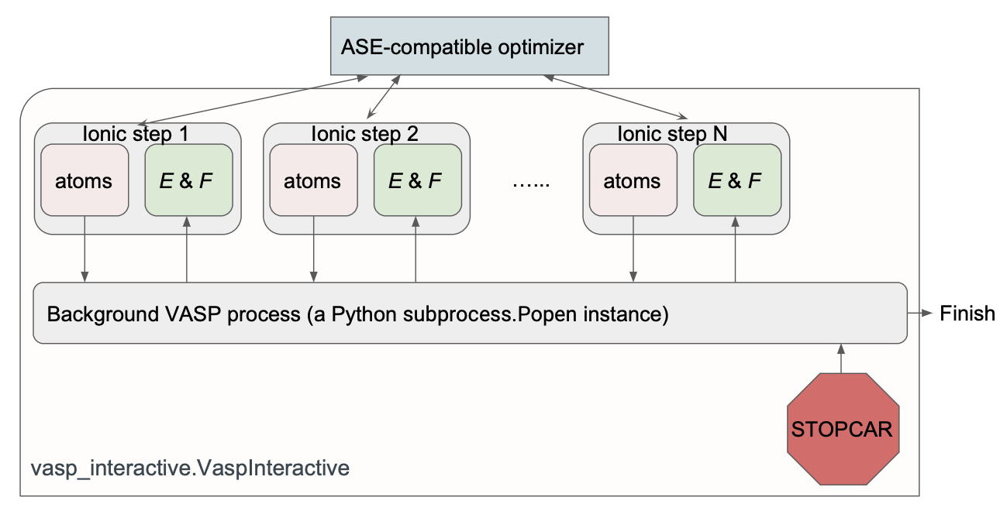
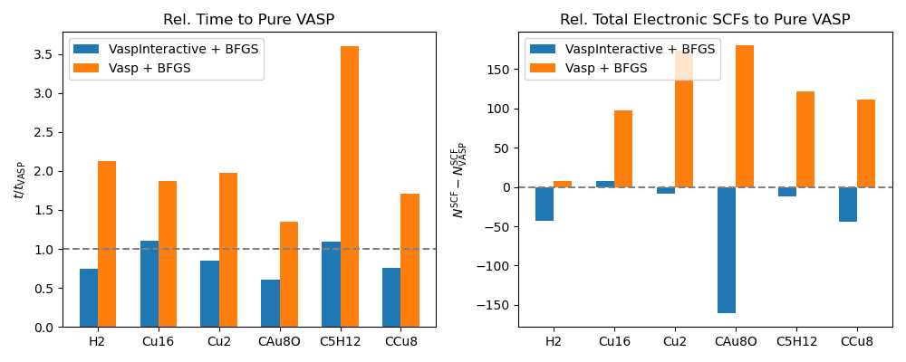
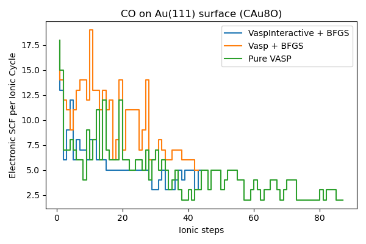
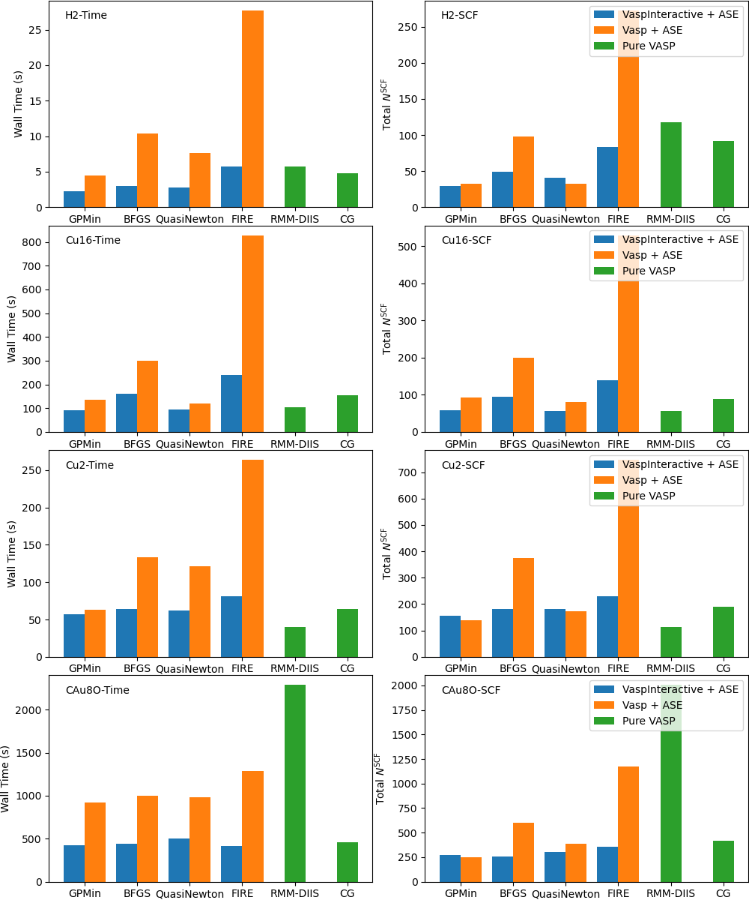
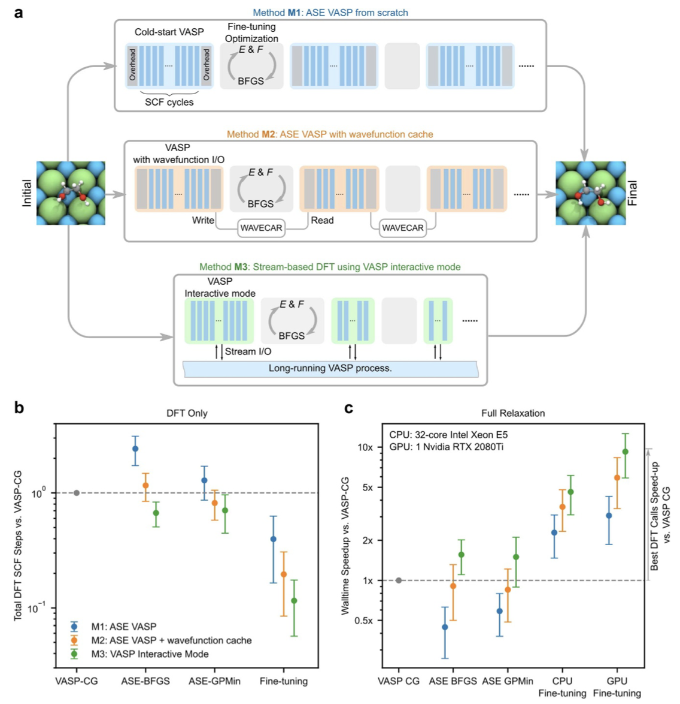
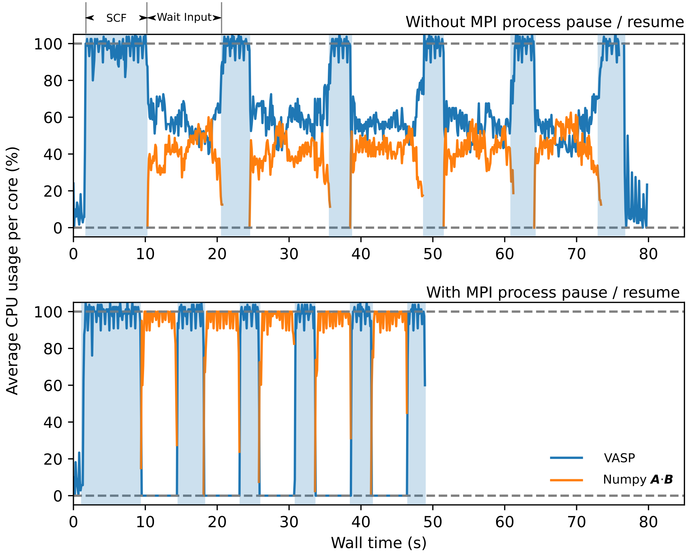

# `VaspInteractive`: a stream-based calculator for VASP
[](https://github.com/ulissigroup/vasp-interactive/actions/workflows/patch_test.yml)


[](https://github.com/ulissigroup/vasp-interactive/actions/workflows/cori_hsw_status.yaml)
[](https://github.com/ulissigroup/vasp-interactive/actions/workflows/cori_knl_status.yaml)
[](https://github.com/ulissigroup/vasp-interactive/actions/workflows/cori_shifter_status.yaml)
[](https://github.com/ulissigroup/vasp-interactive/actions/workflows/perlmutter_gpu_status.yaml)
[](https://github.com/ulissigroup/vasp-interactive/actions/workflows/perlmutter_shifter_status.yml)

# TL;DR

`VaspInteractive` is a faster yet fully-compatible replacement for the original `Vasp` calculator from the 
[Atomic Simulation Environment (`ase`)](https://databases.fysik.dtu.dk/ase/ase/calculators/vasp.html) 
by leveraging the interactive mode of Vienna Ab Initio Package (VASP). Up to 75% reduction of DFT electronic self-consistent 
cycle compared with the original `Vasp` implementation can be achieved (see [Benchmark](#benchmark) section).

### Installation

```bash
pip install git+https://github.com/ulissigroup/vasp-interactive.git
```

After [setting proper environmental variables](https://databases.fysik.dtu.dk/ase/ase/calculators/vasp.html#environment-variables),
download the script and run the compatibility test with your local VASP setup:

```bash
wget https://raw.githubusercontent.com/ulissigroup/vasp-interactive/main/examples/ex00_vasp_test.py
python ex00_vasp_test.py
```

If the compatibility test fails, your VASP build may truncate output. See the [**Troubleshooting**](#troubleshooting) section for more details.


### Basic usage

Existing code written with ase's `Vasp` calculator can be easily replaced by `VaspInteractive`, 
the following example shows how to run a structural optimization using `VaspInteractive` with an BFGS optimizer:
```python
from ase.optimize import BFGS
from vasp_interactive import VaspInteractive
# atoms: an ase.atoms.Atoms object
# parameters: parameters compatible with ase.calculators.vasp.Vasp
atoms.calc = VaspInteractive(**parameters)
dyn = BFGS(atoms)
dyn.run()
# Special to `VaspInteractive`: close the stream manually
calc.finalize()
```

#### (Recommended) `VaspInteractive` in context-mode

To prevent orphan VASP process running in the background if `calc.finalized()` is not properly added,
we recommend using `VaspInteractive` within a context manager (i.e. using the `with`-clause):
```python
from ase.optimize import BFGS
from vasp_interactive import VaspInteractive
# Exiting the with-clause kills the background VASP process
with VaspInteractive(**parameters) as calc:
    atoms.calc = calc
    dyn = BFGS(atoms)
    dyn.run()
```

## How does it work?

### The interactive mode of VASP
This repo provides a patched version of the `VaspInteractive` calculator, 
[originally](https://gitlab.com/ase/ase/-/blob/master/ase/calculators/vasp/interactive.py) 
from ase while focusing on the following improvement:

- Better process management
- Enhanced output parsing for both VASP 5.x and 6.x
- Functionality to pause / resume VASP process 

The following scheme summarizes the mechanism of `VaspInteractive`.



`VaspInteractive` invokes the interactive VASP mode by setting the keyword `INTERACTIVE = .TRUE.` in INCAR file.
Under this mode, at the end of the each ionic step, VASP writes the following blocks to standard output
```
FORCES:
   <Nx3> forces on atoms
   <one line for free energy, energy at T=0 K and energy difference>
POSITIONS: reading from stdin
```
and waits for user input of the scaled positions. After reading the user-input coordinates ($N \times 3$), 
VASP performs the next ionic step using previous density and wavefunction **in memory**.  
In this way, the interactive mode reduces the number of electronic self-consistent cycles compared with
starting the VASP process at each ionic step. `VaspInteractive` is designed as a user-friendly interface to 
automate the I/O in the interactive mode. 

### Input parameters

Most of the parameters in `ase.calculators.vasp.Vasp` are compatible with `VaspInteractive`. 
However there are several things to note:

1. Setting `ibrion` will not enable VASP's internal optimizer. Instead, `VaspInteractive` replies on external optimizers (from ase package, machine learning algorithms, etc.)
2. Make sure the `nsw` value (maximum ionic steps of VASP) is no less than the maximum allowed steps in your optimizer (default `nsw=2000`)
3. Symmetry is disabled (`isym=0`) to avoid spurious error due to wavefunction symmetry mismatch between the steps. 
4. Wavefunction extrapolation is enabled using `lwavepr=11` to ensure convergence. If you want to overwrite this parameter, do your own test.

### Limitations

Most of the issues comes from the way original VASP code is written. If you want more flexible control over
how the DFT calculator interacts with your own optimizer, and is comfortable to switch to other DFT codes, 
the [i-Pi calculator protocol](https://wiki.fysik.dtu.dk/ase/ase/calculators/socketio/socketio.html) may be an
alternative.

- `VaspInteractive` currently does not support change of unit cell. 
- An additional ionic step (with 1 electronic step) will be added to the end of the calculation as a result of STOPCAR 
- Compatibility with VASP depends on the version and how the code is compiled. More details see [**Troubleshooting**](#troubleshooting) section


<!-- 

The ionic cycles of interactive mode VASP can be terminated by any of the following:

1) setting `NSW` values
2) writing STOPCAR file to the calculation directory
3) invalid inputs to stdin (such as `Ctrl+C`)

`VaspInteractive` uses method 2) to stop the ionic cycles. In general, `VaspInteractive` can save up to 50% of the wall 
time compared with classic `Vasp` calculator (combined with ASE optimizers such as BFGS), since less electronic steps are
required and program spin-up time is drastically reduced.  -->
<!-- When combined with active learning frameworks like [Finetuna](https://github.com/ulissigroup/finetuna) it can speed up DFT relaxation up to 1 order of magnitude. -->

<!-- **NOTE: some builds of VASP 5.x may be incompatible wih `VaspInteractive`.**

See this [issue](https://github.com/ulissigroup/vasp-interactive/issues/6.) for details. 
We have seen some builds of VASP 5.x incompatible with `VaspInteractive` due to broken output files.  Switching to VASP version > 6 (if available) or
recompile your VASP binaries may help. 

**Minimal VASP 5.x support**: starting from version 0.0.9, `VaspInteractive` supports VASP 5.x by parsing the raw output (e.g. `vasp.out` file) in case of broken `OUTCAR` / `vasprun.xml` files, although there are several limitations:
1. Only energy and forces can be get from the calculator
2. `VaspInteractive` must not have the `txt` option set to (`"-"` or `None`)


### Note:
For `VaspInteractive` to work properly, the VASP executable (i.e. environment variable `$ASE_VASP_COMMAND` or `$VASP_COMMAND`) must not
filter or redirect the stdout from `vasp_std`. If you want to set the file name for capturing the stdout, add `txt=<your-custom-stdout-file>` to the 
initial parameters of `VaspInteractive`. -->

## Benchmark

### Comparison against original `Vasp` calculator

The following figure shows the benchmark of `VaspInteractive` vs original `Vasp`. The structures for relaxation are taken from the 
GPAW [optimizer benchmark](https://wiki.fysik.dtu.dk/gpaw/devel/ase_optimize/ase_optimize.html) and BFGS is used as the optimizer in all cases.
All calculations are done using AMD Ryzen Threadripper 3990X (8 MPI ranks, 4105.948 GHz) with VASP version 6.1.2 compiled with Intel's MKL library.

Two quantities are compared:
1) Wall time (right panel).
2) Total electronic scf steps (i.e. sum of scf steps per ionic cycle) (left panel).

Performance of relaxation using pure VASP routines (`IBRION=2`, conjugate gradient) is used as the baseline reference. 
`VaspInteractive` reduces the wall time and electronic steps compared with the classic VASP+BFGS appraoch.



Below are the details about the ionic and electronic steps (using system CAu8O):



In the case of CO+Au(111) slab system, `VaspInteractive` seems even to better
than the VASP CG optimizer. Note such results can be tuned by parameters such as IBRION or IWAVEPR.

A more detailed example comparing the wall time and SCF cycles for `VaspInteractive` and classic `Vasp` combined with various ASE-optimizers can be find in the following figure. The horizontal broken lines are the lowest value among all optimizers
for the same structure.



In addition to the constant time reduction using `VaspInteractive+ASE` compared with `Vasp+ASE`, 
`GPMin` seems to be the most reliable optimizer to be combined. In most cases `VaspInteractive+GPMin` 
outperforms VASP internal CG routine (`IBRION=2`) and gives more consistent results than RMM-DIIS (`IBRION=1`).

### Combining `VaspInteractive` with advanced optimizers

The benchmark from previous section shows when combining with better optimizers, 
`VaspInteractive` can outperform internal VASP routines. This becomes even more obvious when
using active learning algorithms such as [FINETUNA](https://github.com/ulissigroup/finetuna) 
([Musielewicz et al. *Mach. Learn.: Sci. Technol.* **3** 03LT01](https://iopscience.iop.org/article/10.1088/2632-2153/ac8fe0)). An excerpt from the FINETUNA study regarding the performance can be seen in the following figure:



The combination of `FINETUNA` + `VaspInteractive` can achieve up to 10x walltime boost compared with internal VASP CG optimizer.

### Parallel `VaspInteractive` calculators for faster NEB calculations

[*Experimental*] A special mode `KubeVaspInteractive` makes the interactive vasp process running inside an 
isolated container on kubernetes pod, with full functioning message communication between the local and remote
processes. This mode can be quite useful when running an ensemble of relaxations with synchronization between
individual steps, and required total CPU numbers are high.

One example is to use `KubeVaspInteractive` to boost Nudged Elastic Bands (NEB) calculations, please see
[examples/ex12_k8s_neb.py](examples/ex12_k8s_neb.py) for more details. 
3-image NEB relaxation for Au diffusion on 2x2x3-Al(001) surface is chosen for benchmark with the following walltime (all calculators use 8X MPI ranks for VASP)
- Sequential VASP: 382.52 s
- Sequential `VaspInteractive` (shared calculator): 532.89 s
- Parallel `KubeVaspInteractive` (3 workers): 49.91 s

Note in this case, sharing `VaspInteractive` on all NEB images is 
not beneficial due to big difference of wavefunctions on neighboring images. 
On the other hand, `KubeVaspInteractive` has nearly linear scaling with worker pod numbers,
if the workload per pod is balanced (see [examples/ex11_k8s_minimal.py](examples/ex11_k8s_minimal.py)).

## Advanced topics

### Resource optimization by MPI pause / resume

By default, the MPI processes that run the VASP calculations will occupy 100% cpu on the allocated cores / slots, even when waiting for the inputs. 
This can lead to undesired effects when other CPU-expensive codes are running between two `VaspInteractive` ionic steps (e.g. huge matrix multiplication in machine learning). 

When `VaspInteractive` calculator is initialized with `allow_mpi_pause=True` (the default setting since `0.0.5`),  the user can temporarily free the resources occupied by VASP processes between two ionic steps. Please see the following minimal example

```python
calc = VaspInteractive(allow_mpi_pause=True, **params)
atoms.calc = calc
atoms.get_potential_energy()
# VASP MPI processes are occupying 100% CPU at this line
with calc.pause():
    # VASP MPI processes are paused (0% CPU)
    do_some_cpu_intensive_calculation()
# VASP MPI processes are resumed (100% CPU)
```

An example can be found in [ex13_pause_mpi.py](examples/ex13_pause_mpi.py), where computationally expensive operations (e.g. `numpy` huge matrix multiplication **A·B**) occur between VASP ionic steps. 
The figures below show the CPU usage of VASP and Numpy processes without intervention (upper panel) and with MPI pause / resume (lower panel). With the pause / resume functionality, the `numpy` threads can gain almost 100% CPU, saving the total computational time.
 


Alternatively, you can also wrap the DFT part with the context so that outside the MPI CPU usage is always 0:
```python
calc = VaspInteractive(allow_mpi_pause=True, **params)
atoms.calc = calc
with calc._ensure_mpi():
    # Inside the context, MPI processes can use full cpu resources
    atoms.get_potential_energy()
# Outside the context, MPI process is paused. You can write longer code here.
do_some_cpu_intensive_calculation()
```

**Notes**
- The MPI process pause / resume has been tested on OpenMPI > 1.3.0. For some systems you may need to explicitly add the flag `--mca orte_forward_job_control 1`.
- If your VASP commands are run by SLURM job manager's `srun` command, the signal is sent by `scancel` utility instead of forwarding to `mpirun` directly. Make sure you have access to these utilities in your environment
- Each pause / resume cycle adds an overhead of 0.5 ~ 5 s depending on your system load.


## More examples
- [examples/ex01_h2_relax.py](examples/ex01_h2_relax.py): Basic example of structural relaxation
- [examples/ex02_h2_comparison.py](examples/ex02_h2_comparison.py): Comparing `VaspInteractive` with pure VASP and VASP+BFGS
- [examples/ex03_exception.py](examples/ex03_exception.py): Example of error handling and garbage collection
- [examples/ex04_reset_calculator.py](examples/ex04_reset_calculator.py): Restarting `VaspInteractive` for various structures (different formulae)
- [examples/ex05_rattle_atoms.py](examples/ex05_rattle_atoms.py): Apply `VaspInteractive` to sequence of structures (same formula, different positions)
- [examples/ex06_benchmark.py](examples/ex06_benchmark.py) and [examples/ex07_benchmark.py](examples/ex07_benchmark.py): Running benchmark. You can delete `examples/benchmark.pkl` and `examples/benchmark-large.pkl` if you want to re-run the calculations (may take up to a few hours).
- [examples/ex08_dask_par.py](examples/ex08_dask_par.py): Simple example running parallel relaxation jobs using Dask. See `examples/ex08_sample_output.txt` for an example of output.
<!-- - [examples/ex10_mlp_online.py](examples/ex10_mlp_online.py): Example with online machine learning potential (`al_mlp` + `amptorch`).
 -->
 
## Troubleshooting

### Compatibility test fails

The compatibility test code in the [installation](#installation) section may show several different outputs

1. <span style="color:green">**All pass**</span>: Raw output, OUTCAR and vasprun.xml are all complete
2. <span style="color:olive">**Partial pass**</span>: Raw output and OUTCAR files can be parsed by vasprun.xml is truncated
3. <span style="color:orange">**Minimal support**</span>: Raw output can be parsed while OUTCAR & vasprun.xml are both truncated
4. <span style="color:red">**Incompatible**</span>: VASP does not print stdout during interactive mode

Below are some of the test results for various VASP builds we have access to, including the [Cori](https://docs.nersc.gov/systems/cori/) and [Perlmutter](https://docs.nersc.gov/systems/perlmutter/) clusters
from NERSC.

<!-- PLACEHOLDER BEGIN -->

|          | Docker images (**) | Cori Haswell (†) | Cori KNL (†) | Perlmutter CPU (†) | Perlmutter GPU (†)  |
| ---------- | ---------- | ---------- | ---------- | ---------- | ----------  |
| VASP 5.4.x |  |  |  |  |   |
| VASP 5.4.x - TPC (*) |  |  |  |  |   |
| VASP 6.1.x |  |  |  |  |   |
| VASP 6.2.x |  |  |  |  |   |
| VASP 6.2.x - TPC (*) |  |  |  |  |   |
| VASP 6.3.x |  |  |  |  |   |
| VASP 6.3.x - TPC (*) |  |  |  |  |   |

<!-- PLACEHOLDER END -->

- (*) TPC=third-party codes 
- (**) Internal docker images in ulissi-group. Tested both on local cluster (Kubernetes) and NERSC shifter
- (†) Slurm jobs are calculated using `srun -u` option to supress any buffer in pipeline I/O. Necessary for Perlmutter CPU.

In the all / partial pass cases, `VaspInteractive` should be able to handle I/O correctly, 
while in the case of minimal support (likely using VASP 5.4.x), only the energy and force information are parsed.

If you have an incompatible VASP build, consult your sysadmin or use VASP in container images.

### `VaspInteractive` fails to parse VASP 5.4.x outputs

As stated above, in some VASP 5 cases the support is minimal. Please ensure the flag `parse_vaspout=True` is set during the
calculator initialization and `txt` parameter is neither `"-"` nor `None`, because the parsing of VASP raw output requires a 
real file on disk.

### `VaspInteractive` hangs up forever after the first ionic step

First, make sure the [compatibility test](#installation) passes. Please also disable any output redirection in the VASP command
env variables. If you want to achieve something like `mpirun -n 16 vasp_std > vasp.out`, 
set the `txt` parameter of the calculator instead.

### "The OUTCAR and vasprun.xml outputs may be incomplete" warning

In many cases user may see warnings like follows when `VaspInteractive` exits:
```
Trying to close the VASP stream but encountered error: 
<error message>
Will now force closing the VASP process. The OUTCAR and vasprun.xml outputs may be incomplete
```
As the message indicates, it is caused by some runtime error when terminating VASP process associated with `VaspInteractive`. 
Usually this is harmless but if you suspect it may be caused by a bug, please [submit your issue](https://github.com/ulissigroup/vasp-interactive/issues) in the github page.

### Pause / resume does not have effect

There may be several causes for this:
1. Your VASP program is not started using the standard `mpirun` / `mpiexec` or `srun` method. 

    You will be notified by a warning like: `
    Cannot find the mpi process or you're using different ompi wrapper. Will not send continue signal to mpi.
    `
    

2. The SIGTSTP / SIGCONT signals sent to associated processes are not properly propagated. 

    You may need to update OpenMPI / MPICH version and enable signal forwarding.

3. The current user does not have privilege sending signals to VASP processes. 

    This is likely the case in SLURM job manager. We have added support for `srun` but may not be extensive. 
    Please submit an issue regarding your specific situation.


    
    
